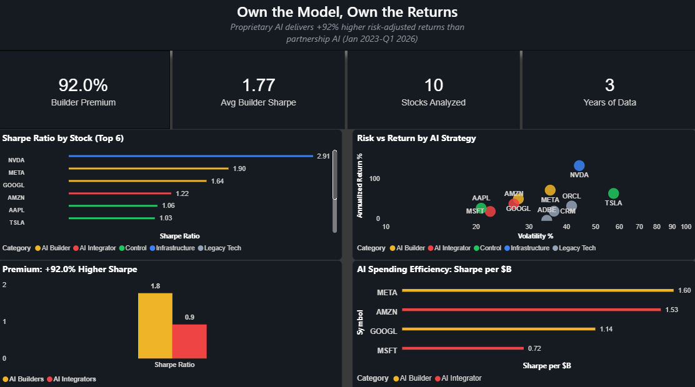

# The AI Integration Premium: Sharpe Ratio Analysis

A data engineering pipeline that analyzes whether building proprietary AI delivers superior risk-adjusted returns versus integrating third-party AI. Ingests daily stock data for 10 tech companies via Apache Airflow on Docker, stores in AWS S3, queries with Athena, and visualizes findings in Power BI.

## Key Finding: The Market Rewards AI Builders, Not AI Renters

Analysis of 3-year risk-adjusted returns (2023-2025) across 10 major tech stocks reveals a clear **AI value chain hierarchy** in Sharpe ratios:

| Tier | Companies | Avg Sharpe | AI Strategy |
|------|-----------|-----------|-------------|
| Infrastructure | NVDA | 3.335 | Sells the GPUs |
| AI Builders | META, GOOGL | 2.174 | Proprietary AI (Llama, Gemini, custom chips) |
| AI Integrators | MSFT, AMZN | 1.372 | Third-party partnerships (OpenAI, Anthropic) |
| Control | AAPL, TSLA | 1.272 | Mixed AI exposure |
| Legacy Tech | CRM, ORCL, ADBE | 0.638 | Traditional software |

**Builder Premium: +58.4%** - Companies building proprietary AI outperform those renting it through partnerships by 58% on risk-adjusted returns.



In 2026, Big Tech will spend ~$650B on AI infrastructure. But spending more doesn't mean earning more - Meta spends the least of the four hybrids ($125B) yet delivers the highest Sharpe ratio (2.369) because nearly 100% of its capex goes to proprietary AI. Amazon spends the most ($200B) but dilutes returns across logistics and third-party partnerships.

## Architecture

```
┌─────────────┐     ┌──────────────┐     ┌──────────┐     ┌─────────┐
│  Data Source │────>│ Apache Airflow│────>│  AWS S3   │────>│ Athena  │
│              │     │  (Docker)    │     │ (Data Lake)│    │ (Query) │
│ Alpha Vantage│     │              │     │           │     └────┬────┘
│  (10 stocks) │     │ Scheduled    │     │ Partitioned│         │
│              │     │ DAGs w/      │     │ by date   │    ┌────▼────┐
└─────────────┘     │ rate limiting│     └───────────┘    │ Power BI│
                    └──────────────┘                       │(Dashboard)│
                                                           └─────────┘
```

## Stock Pipeline (`stock_pipeline.py`)
- **Stocks:** NVDA, MSFT, GOOGL, AMZN, META, CRM, ORCL, ADBE, AAPL, TSLA
- **Source:** Alpha Vantage API (Global Quote)
- **Schedule:** 5 PM ET Mon-Fri (after market close)
- **Rate limiting:** 12-second intervals for free-tier compliance

### Additional Pipelines

The repo also includes pipelines demonstrating multi-source ingestion:
- **Crypto** (`crypto_pipeline.py`): BTC, ETH, SOL via Coinbase API (6-hour schedule)
- **Weather** (`weather_pipeline.py`): Brooklyn, NY via OpenWeatherMap API (daily)
- **Monitor** (`pipeline_monitor.py`): Health checks across all pipelines

## Historical Backtest (`historical_backtest.py`)

Pulls 3 years of monthly adjusted close prices and calculates:
- Annualized return, volatility, and Sharpe ratio per stock
- Category-level averages across the AI value chain
- Build vs. Rent premium (proprietary AI vs. partnership AI)
- Capex efficiency (Sharpe per $B of estimated AI spend, sourced from 2025/2026 earnings guidance)

## Tech Stack

| Component | Technology |
|-----------|-----------|
| Orchestration | Apache Airflow 2.10.4 (CeleryExecutor) |
| Infrastructure | Docker Compose (6 containers) |
| Storage | AWS S3 (NDJSON, date-partitioned) |
| Query Engine | AWS Athena (Presto SQL) |
| Visualization | Power BI |
| Language | Python 3.12 |
| Key Libraries | boto3, pandas, numpy, requests |

## Security

All credentials managed via environment variables - zero hardcoded secrets:
- AWS credentials (`AWS_ACCESS_KEY_ID`, `AWS_SECRET_ACCESS_KEY`)
- API keys (`ALPHA_VANTAGE_API_KEY`)
- Injected into Airflow containers via Docker Compose `.env` file
- `.gitignore` prevents credential files from being committed

## Project Structure

```
data-engineering-portfolio/
├── stock_pipeline/
│   ├── stock_pipeline.py          # Airflow DAG: 10-stock ingestion
│   ├── historical_backtest.py     # 3-year Sharpe ratio analysis
│   ├── portfolio_analysis.py      # Build vs Rent + capex efficiency
│   ├── backtest_results.json      # Stock-level results
│   ├── backtest_results.csv       # Stock-level CSV
│   ├── powerbi_master.csv         # Power BI master dataset
│   ├── build_vs_rent.csv          # Builders vs Integrators comparison
│   ├── capex_efficiency.csv       # Sharpe per $B of AI spend
│   ├── category_summary.csv       # Category-level averages
│   └── value_chain_summary.csv    # Full value chain rankings
├── crypto_pipeline/
│   └── crypto_pipeline.py         # Airflow DAG: BTC, ETH, SOL
├── weather_pipeline/
│   └── weather_pipeline.py        # Airflow DAG: Brooklyn weather
├── monitoring/
│   ├── pipeline_monitor.py        # Airflow DAG: health checks
│   └── data_quality.py            # Validation functions
├── queries/
│   └── sample_queries.sql         # Athena SQL showcase queries
├── .env.example                   # Template for credentials
├── .gitignore
├── requirements.txt
└── README.md
```

## Setup

### Prerequisites
- Docker Desktop
- Python 3.12+
- AWS account (S3, Athena)
- API keys: Alpha Vantage

### Quick Start
```bash
# 1. Clone the repo
git clone https://github.com/ericg1212/data-engineering-portfolio.git
cd data-engineering-portfolio

# 2. Create .env file with your credentials
cp .env.example .env
# Edit .env with your API keys and AWS credentials

# 3. Start Airflow
docker compose up -d

# 4. Copy DAGs to Airflow
cp stock_pipeline/stock_pipeline.py dags/
cp monitoring/*.py dags/

# 5. Access Airflow UI
# http://localhost:8080 (airflow/airflow)

# 6. Run the historical backtest
python stock_pipeline/historical_backtest.py
```

## Data Source

| Source | API | Rate Limit |
|--------|-----|-----------|
| [Alpha Vantage](https://www.alphavantage.co/) | Stock quotes + monthly history | 25 calls/day (free) |
